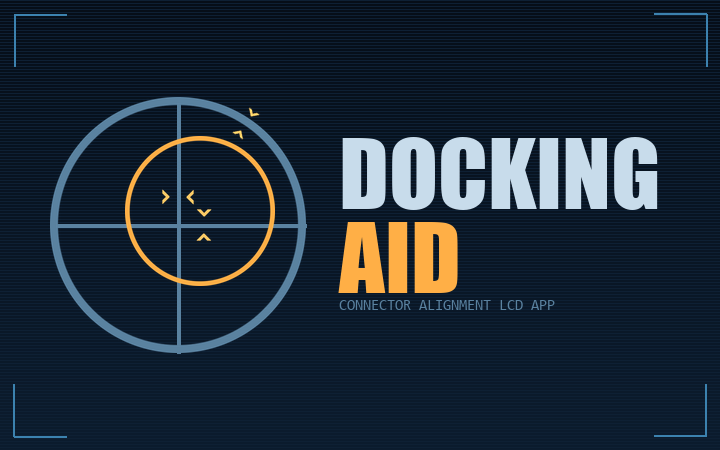

An in-cockpit LCD app for Space Engineers that turns any text panel into a
live docking indicator. Each enabled connector scans for the nearest valid
target on a *different* mechanical construct; the LCD picks whichever pair
is currently tracking and renders it from the pilot's frame. Pitch, yaw and
roll chevrons show which stick to push, and which way - same rule on every
mount (forward, aft, side, top, bottom), no per-mount remap.

The player-facing description in [WORKSHOP.md](WORKSHOP.md) goes deeper with
visual examples; this README is the developer-side entry point.

## What it shows

- **Reticle + cross** - your bore frame
- **Projected target ring** - where the partner connector is, foreshortened
  by relative tilt
- **Pitch / yaw notches on the cross** - input needed on the matching stick
- **Roll chevron on the rim** - input needed on the roll stick
- **Off-screen arrow** - when the target ring drifts outside the panel, a
  triangle pins to the rim pointing the way to move
- **Range / closure rate** - top-left / top-right numeric readouts
- **Connector name** - bottom-centre, so you know which pair is locked in

Status colours follow the standard alignment ladder: green when all three
(lateral / forwards / mating-roll) are inside the docked band; amber for the
warn band; red outside that.

## Setup

1. The source ship needs a working, broadcasting **radio antenna**. The
   target ship needs one too, and their broadcast ranges have to overlap -
   the same "mutual antenna" rule SE uses for ID broadcasts.
2. On any LCD on the same mechanical construct as the source connector,
   pick the **Docking Aid** script.
3. Sit in any cockpit / control seat on that construct. The LCD orients
   itself to the active pilot's frame.

Every connector contributes by default. The terminal exposes two
per-connector controls under the vanilla "Use for parking":

- **Used for docking** (default: on) - turn off on connectors that
  shouldn't contribute, like ejectors.
- **Docking detection range** (slider, 1-50 m, default 20 m) - how far
  that connector looks for a target.

A target counts when its connector has either **Used for docking** or
vanilla **Trading** enabled, sits on a *different* mechanical construct
from the source, within the source's detection range, with its bore within
45° of anti-parallel to the source's bore (i.e. roughly facing it). The
Trading clause means NPC trade stations are reachable with no setup on
their end.

## Building

MDK2-based. From the repo root:

```powershell
dotnet build Mal.DockingAid.slnx
```

Tests:

```powershell
dotnet test Mal.DockingAid.Tests/Mal.DockingAid.Tests.csproj -p:Platform=x64
```

The MDK2 packager emits the deployable mod folder on build; copy or symlink
its output into `%AppData%\SpaceEngineers\Mods\` to load locally.
