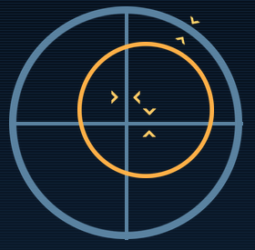
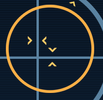
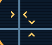
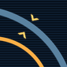
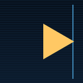

## Docking Aid

Turns any LCD on your ship into a live docking aid. Pitch, yaw and roll[^axes] chevrons show you which stick to push, and which way. Same rule on every mount - forward, aft, side, top, bottom - no mental gymnastics.

## What the screen shows

|     | Element | Description |
|:---:|:---|:---|
|  | **Outer ring + cross** | Your connector's bore, fixed at the centre of the panel. |
|  | **Coloured inner ring** | The partner connector, projected into your view. Concentric and same-size means you're aligned; offset and foreshortened means there's work to do. |
|  | **Chevrons on the cross** | Pitch and yaw error. Push the matching stick toward the chevron and the error nulls. |
|  | **Chevrons on the rim** | Roll error, same rule. |
|  | **Off-screen arrow** | When the target ring sits outside the panel, the ring is replaced by a triangle pinned to the rim, pointing the way you need to move to bring the target back into view. |

Two more readouts, not in the crops above:

- **RNG / CLO** - range to the docking point and closure rate, top corners of the panel.
- **Connector name** - bottom of the panel, so multi-connector ships are unambiguous.

Ring colour follows the alignment band: green inside the docked tolerance, amber for warning, red outside. The screen reads **READY** when the locks will engage and **LOCKED** once you've docked.

## Mount orientation

Your docking connector can sit anywhere on the ship - forward, aft, side, top, or bottom - and the same chevron rule still works. Push the stick toward the chevron and the alignment error nulls, every time. No "this stick now means that on this mount" remap.

How: imagine a camera sitting at your docking connector, looking the way it docks. The camera's "up", though, comes from your cockpit, not the connector. So even if the dock is bolted to your belly or sticks out sideways, the chevrons line up with the pitch, yaw and roll you already know from the stick. A rear-mounted connector reads the same as a forward one - you're still flying your ship the way you always do, just headed tail-first toward the partner.

That's also why the panel falls back to **NO PILOT REFERENCE** when nobody is in a controllable seat - without an active cockpit, there's no "up" to anchor the chevron mapping to.

## Setup

1. Both ships need a working radio antenna with **Broadcasting** on, and their ranges have to overlap - the same handshake SE uses for ID broadcasts.
2. On any LCD on the construct you're docking from, pick the **Docking Aid** script.
3. Sit in a cockpit on that construct. The indicator orients to whoever's actively piloting.

That's it for the common case - every connector contributes by default.

## Per-connector tuning

Each connector gets two terminal controls just below the vanilla "Use for parking":

- **Used for docking** (default: on) - turn off on connectors that shouldn't contribute, like ejectors.
- **Docking detection range** (slider, 1-50 m, default 20 m) - how far that connector looks for a target.

## Trade stations work too

A target connector counts if either **Used for docking** *or* vanilla **Trading** is enabled on it - so NPC trade stations are reachable with no setup on their end. Player-built trade hubs benefit from the same rule.

## Troubleshooting

If the LCD shows one of these instead of the indicator:

- **NO DOCKING CONNECTOR** - no connector on this construct has the docking checkbox enabled.
- **NO ANTENNA** - your ship has no working, broadcasting antenna.
- **NO TARGET** - nothing usable in range. The smaller hint narrows it: *no antenna link* (the target's antenna isn't reaching yours - check that Broadcasting is on), *no usable connectors* (a candidate's connectors are unconfigured, busy or unpowered), or *wrong orientation* (you're close, just not facing each other).
- **NO PILOT REFERENCE** - nobody is piloting the construct, so "up" is undefined. Sit in a cockpit.

## On dedicated servers

Server-friendly: the per-connector scan runs only on the clients that render LCDs, so the dedi process does no extra work for this mod.

[^axes]: Pitch (nose up/down), yaw (nose left/right), and roll (banking around the forward axis) are the three rotation axes from the pilot's perspective. Each maps to a stick input.
